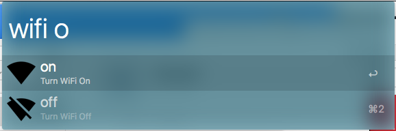

# Alfred WiFi Workflow

Very simple workflow to turn WiFi on/off from Alfred

## Install

Check [releases](https://github.com/dvcrn/alfred-wifi-toggle/releases/latest) for the latest packaged
workflow

## Usage

- `wifi on` will turn the WiFi on
- `wifi off` will turn the WiFi off
